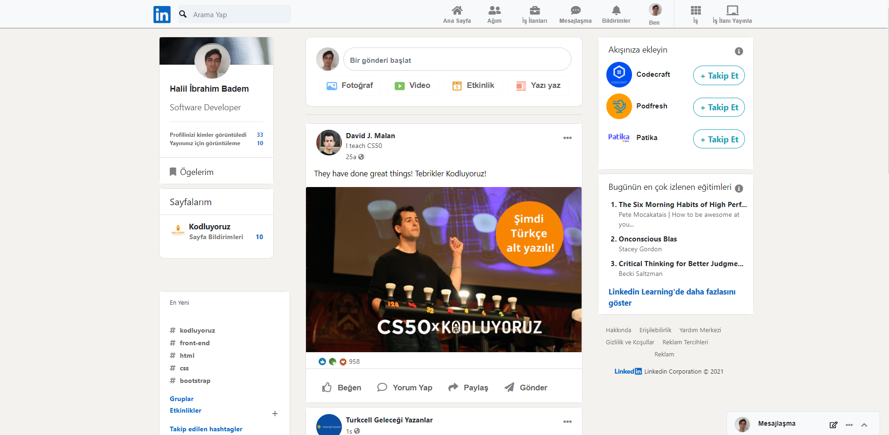

# Linkedin Homepage Clone

<p align="center">
  
</p>

## Installation

Öncelikle projeyi clonelayın.

```bash
git clone https://github.com/hibadem/linkedin-clone.git
```

## Usage

Projeyi cloneladıktan sonra açınız.

```linux
cd linkedin-clone/
```

Projeyi çalıştırın

```linux
code .
```
